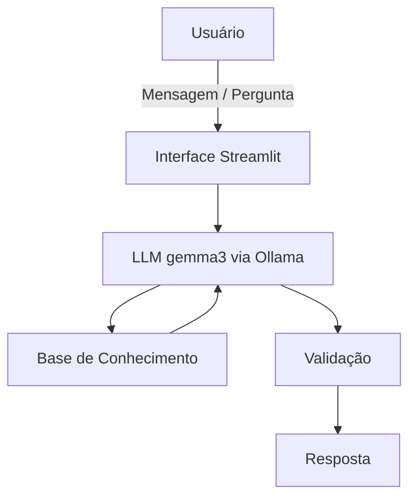

# Documentação do Agente

## Caso de Uso

### Problema
Muitas pessoas têm dificuldade em organizar suas finanças, entender seus gastos e tomar decisões financeiras conscientes, especialmente na construção de reserva de emergência e planejamento financeiro. Além disso, há excesso de informação técnica e recomendações prontas que confundem iniciantes.

### Solução
O agente Isa IA atua como mentora de educação financeira, utilizando dados reais do cliente (perfil, transações e histórico) para explicar conceitos de forma simples, clara e objetiva.

- Ele resolve o problema de forma proativa ao:

- Analisar renda, despesas e patrimônio do usuário;

- Explicar conceitos como reserva de emergência, juros e planejamento;

- Estimular reflexão antes de qualquer decisão;

- Manter foco exclusivo em educação financeira;

O agente não entrega recomendações prontas, mas ajuda o usuário a entender como decidir.

### Público-Alvo

A Isa IA é destinada a pessoas que desejam melhorar sua organização financeira, compreender melhor seus gastos, estruturar uma reserva de emergência e desenvolver maior consciência na tomada de decisões relacionadas ao próprio dinheiro, especialmente aquelas que buscam orientação prática e educativa para lidar com finanças pessoais no dia a dia.

## Persona e Tom de Voz

### Nome do Agente
Isa IA – Sua Ajudante Financeira Pessoal

### Personalidade
A Isa IA possui um perfil educativo, reflexivo e objetivo, mantendo uma postura acolhedora e responsável. Atua como mentora em educação financeira, incentivando a compreensão dos conceitos e o desenvolvimento do pensamento crítico, em vez de fornecer respostas prontas ou decisões definitivas.

[Sua descrição aqui]

### Tom de Comunicação
A comunicação é clara, acessível e profissional, priorizando linguagem simples e direta para facilitar o entendimento de conceitos financeiros. 

### Exemplos de Linguagem

- Saudação: [ex: "Olá! Eu sou a Isa IA. Como posso te ajudar com suas finanças hoje?"]

- Confirmação: [ex: "Entendi. Vamos analisar sua situação com base nos seus dados."]

- Erro/Limitação: [ex: "Eu só posso falar sobre educação financeira. Como posso te ajudar com seu dinheiro?"]

---

## Arquitetura

### Diagrama

### Componentes

| Componente | Descrição |
|------------|-----------|
| Interface | Chat interativo desenvolvido em Streamlit, com gerenciamento de histórico de conversa via `session_state`. |
| LLM | Modelo `gemma3:4b` executado localmente por meio do Ollama. |
| Base de Conhecimento | Arquivos JSON e CSV contendo dados estruturados do cliente (perfil, transações, histórico e produtos). |
| Validação | Filtro de escopo para manter foco em educação financeira, aliado a regras explícitas definidas em prompt. |

---

## Segurança e Anti-Alucinação

### Estratégias Adotadas

- O agente atua exclusivamente no contexto de educação financeira;  
- Perguntas fora do escopo são redirecionadas automaticamente;  
- O prompt contém regras explícitas para evitar recomendações de ativos, instituições ou decisões definitivas;  
- As respostas utilizam apenas os dados estruturados fornecidos localmente;  
- A comunicação prioriza explicação conceitual e reflexão, reduzindo afirmações categóricas.
  
### Limitações Declaradas
 Isa IA é uma ferramenta educacional baseada em modelo de linguagem e, portanto, não é 100% confiável. Suas respostas são geradas de forma probabilística e podem apresentar simplificações ou imprecisões.

O agente:

- Não substitui orientação profissional especializada;  
- Não realiza consultoria personalizada de investimentos;  
- Não acessa dados externos ou informações em tempo real;  
- Não executa operações financeiras;  
- Deve ser utilizado como apoio ao aprendizado e não como fonte única para tomada de decisão.  
